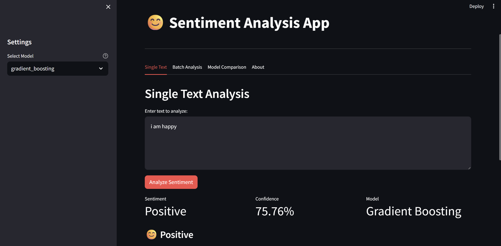
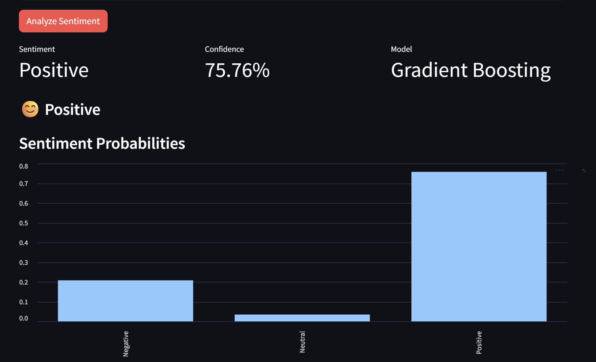
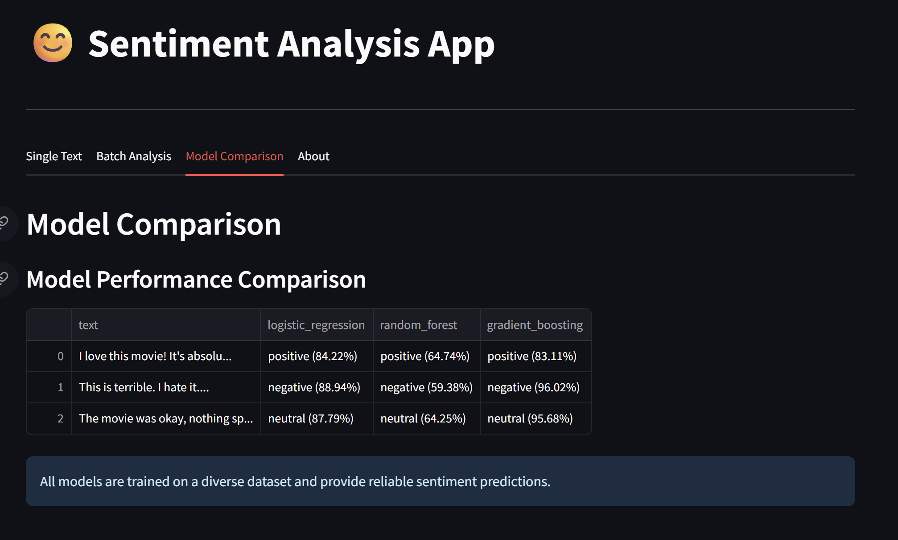

# Sentiment Analysis Project

## Overview
This project implements a comprehensive sentiment analysis system capable of determining the sentiment (positive, negative, or neutral) of given text. The system applies fundamental AI concepts including Natural Language Processing (NLP), Machine Learning, and Text Classification.

## Features
- **Multiple Datasets**: Support for Sentiment140 and IMDB movie review datasets
- **Feature Extraction**: Bag-of-words, TF-IDF, and Word2Vec embeddings
- **Multiple Models**: Logistic Regression, Gradiant Boosing, Random Forest
- **Comprehensive Evaluation**: Accuracy, precision, recall, F1-score, and confusion matrix
- **Visualization**: Word clouds, sentiment distribution, and model performance plots
- **Interactive Demo**: Web interface for real-time sentiment analysis

## AI Concepts Implemented
1. **Natural Language Processing (NLP)**: Text preprocessing, tokenization, stemming
2. **Machine Learning**: Supervised learning for text classification
3. **Feature Engineering**: Multiple text representation techniques
4. **Model Evaluation**: Comprehensive performance metrics


## Installation
1. Clone the repository
2. Install dependencies:
   ```bash
   pip install -r requirements.txt
   ```
3. Download NLTK data:
   ```python
   python -c "import nltk; nltk.download('punkt'); nltk.download('stopwords'); nltk.download('wordnet')"
   ```

## Usage
1. **Train Models**: Run `python train_model_simple.py` to train all models
2. **Web Interface**: Run `python -m streamlit run web_app.py` for interactive demo
3. **Notebooks**: Explore `notebooks/` for detailed analysis


## Working Prototype:
## Working Prototype:

## Working Prototype:






## Model Performance
The project compares multiple approaches:
- Traditional ML (Logistic Regression, Gradiant Boosing, Random Forest)
- Feature extraction methods (BoW, TF-IDF, Word2Vec)
- Comprehensive evaluation metrics

## Technologies Used
- **Python**: Core programming language
- **scikit-learn**: Machine learning framework
- **NLTK**: Natural language processing
- **Gensim**: Word embeddings
- **Streamlit**: Web interface
- **Matplotlib/Seaborn**: Visualization 

## Project Structure
```
sentiment_analysis/
├── data/                   # Dataset storage
├── models/                 # Trained model files
├── notebooks/             # Jupyter notebooks for exploration
├── src/                   # Source code
│   ├── data_loader.py     # Dataset loading utilities
│   ├── preprocessing.py   # Text preprocessing functions
│   ├── feature_extraction.py # Feature extraction methods
│   ├── models.py          # ML model implementations
│   ├── evaluation.py      # Model evaluation utilities
│   └── visualization.py   # Plotting and visualization
├── web_app.py             # Streamlit web application
├── train_model.py         # Model training script
└── requirements.txt       # Dependencies
```
